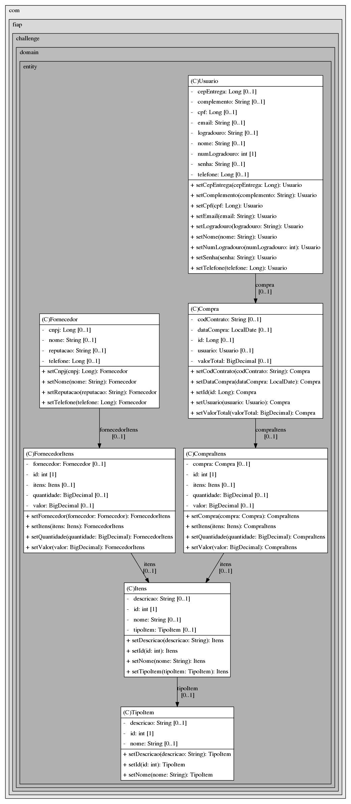
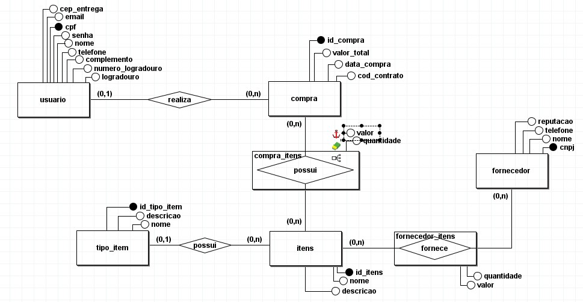

# Procura Certa

Equipe

Gustavo Guarnieri de Melo (RM 97100) - Database Application, Hybrid Mobile, Quality Assurance
Gustavo Santos Nascimento (RM 96687) - DevOps Tools, Digital Bussines, Quality Assurance
Vinícius Almeida Kotchetkoff (RM 96331) - Database Application, Enterprise Application Development, Quality Assurance
Vinicius Rodrigues Brito (RM 97473) - Architectures IoB e IA, Digital Bussines, Quality Assurance
William Mendes Vulcano (RM 96939) - Architectures IoB e IA, Hybrid Mobile, Quality Assurance

Como rodar:

Para rodar o aplicativo, siga estas instruções:

Clone o projeto do GitHub:
git clone https://github.com/Vinikot/Challenge-Enterprise.git

Escolha o banco de dados que deseja usar e rode a aplicação.  As tabelas serão criadas e os dados mockados persistidos.

Diagrama de Classes

[Imagem do diagrama de classes]

Diagrama de banco de dados

[Imagem do diagrama de banco de dados]

Vídeo

https://youtu.be/lHB2Ep6-EFM